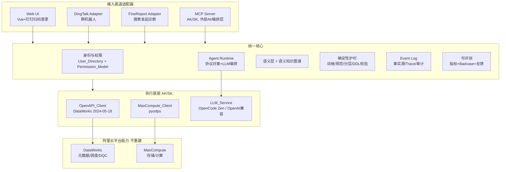
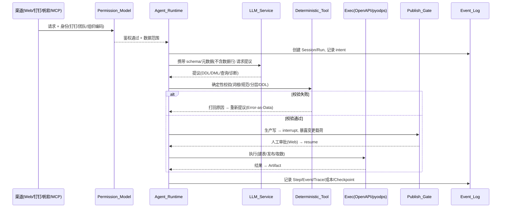
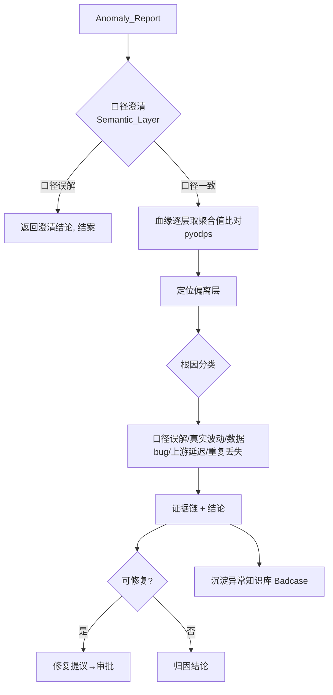

# Design Document

## Overview

本设计描述 dataworks-agent 从"数仓建模工具"演进为 **dataworks 语义化数据基础设施 + 领域特化 Agent 平台**的技术方案，落实 requirements.md 的 35 条需求。

设计遵循四条主轴：

1. **鉴权与执行底座按能力矩阵分工**（⚠️2026-07 修正：非"删除 Cookie / CDP 链路"）：当前 AK/SK 仅有开发环境权限，覆盖建表/建节点/调度/发布/DI/Holo/节点级血缘等执行类操作；Cookie / CDP 链路长期保留，兜底 AK/SK 无权限的元数据浏览类操作（数据源列表、搜表、目录树、下游血缘）。执行底座 = DataWorks OpenAPI 2024-05-18 + MaxCompute pyodps（AK/SK 覆盖范围）+ 现有 BFF_Client（Cookie 兜底范围）。
2. **语义层为核心**：把词根、口径、维度、别名、权限、质量信号收敛成机器可读的单一事实源，作为人 / agent / 帆软报表的共享口径来源。
3. **Runtime 协议对象稳定、执行引擎可替换**：以 Session / Run / Step / Event / Artifact / Checkpoint 六对象 + stream/interrupt/resume/cancel/retry 五操作为稳定契约；L0-L3 自建薄 runtime（复用现有 SQLite 原语），L4 可换 LangGraph 而不动领域逻辑。
4. **多渠道接入、统一核心**：Web / 钉钉 / 帆软 / MCP 四渠道以适配器接入同一核心；统一走 Permission_Model 鉴权、Event_Log 审计、数据边界与"LLM 提议 → 确定性校验 → 人审批"护栏。

设计尽量复用现有资产（`modeling/`、`governance/`、`standards/`、`naming/`、`task_engine/`、FastAPI + Vue + SQLite），新增 AK/SK 执行客户端并按能力矩阵接入调用点（Cookie 相关模块保留作长期兜底，非替换对象），并在其上叠加语义层、LLM 编排与渠道适配器。

## 术语与需求映射

设计沿用 requirements.md 的 Glossary 术语（The_Platform、Auth_Provider、OpenAPI_Client、MaxCompute_Client、LLM_Service、Semantic_Layer、Semantic_Graph、Agent_Runtime、Event_Log、Permission_Model 等），不再重复定义。每个组件章节末尾标注其覆盖的 Requirement 编号。

## Architecture

### 分层架构



### 请求主链路（一次建模/诊断）



## Components and Interfaces

### 1. 执行底座

#### 1.1 Auth_Provider（`dataworks_agent/auth/credentials.py` 新增）

单一职责：从环境变量提供 AK/SK，供 OpenAPI_Client、MaxCompute_Client、MCP_Server 复用。

```python
class AliyunCredentials:
    access_key_id: str      # 来自 ALIYUN_ACCESS_KEY_ID
    access_key_secret: str  # 来自 ALIYUN_ACCESS_KEY_SECRET

def load_credentials() -> AliyunCredentials:
    """启动时校验；缺失则抛 CredentialMissingError 阻止阿里云操作。"""
```

- 不读 ECS RAM Role、不读本地 credentials 文件。
- 密钥不进日志（脱敏在 Event_Log 写入层统一处理）。
- 覆盖 Requirement 2、20。

#### 1.2 OpenAPI_Client（`dataworks_agent/api_clients/openapi_client.py` 已实现，与 bff_client 长期并存分工，非替换）

基于 `alibabacloud_dataworks_public20240518` + `alibabacloud_tea_openapi`。⚠️以下方法名已按真实 SDK 表面核实并落地实现（CLAUDE.md §7 记录了与 design 早期假设方法名的差异，那批假设方法名已废弃，不要再参照）：

```python
class DataWorksOpenAPIClient:
    def __init__(self, creds: AliyunCredentials, region: str, project_id: int): ...
    # 节点（脚本/调度内嵌于 FlowSpec，无独立 update_node_script/get_node_schedule）
    async def create_node(spec, container_id, scene); async def update_node(node_id, spec)
    async def get_node(node_id); async def list_nodes(...); async def list_node_dependencies(node_id)
    # 发布（Deployment 系，非 deploy_node）
    async def create_deployment(...); async def get_deployment(...); async def exec_deployment_stage(...)
    # 元数据（DataMap 层级下钻：catalog→database→schema→table→column）
    async def get_table(...); async def list_tables(...); async def list_catalogs(...)
    async def list_databases(...); async def list_schemas(...); async def list_columns(...)
    # 血缘（需 dataworks:ListLineages 权限，当前 403，长期走 bff_client）
    async def list_lineages(...)
    # 数据源 / DI
    async def list_data_sources(...); async def get_data_source(...)
    async def create_dijob(...); async def get_dijob(...); async def list_dijobs(...)
    async def start_dijob(...); async def stop_dijob(...)
    # 数据质量（DQC 只读消费）
    async def list_data_quality_evaluation_tasks(...); async def list_data_quality_rules(...)
    async def list_data_quality_results(...)
```

- 内建指数退避（流控）、错误分类（可重试/不可重试）。
- 仅 2024-05-18，不与 2020-05-18 混用。
- **与 bff_client 分工**：上述方法在当前 AK/SK（开发权限）下多数可用并已真机验证（节点/建表/DI/Holo/节点级依赖）；`list_data_sources`/`list_catalogs`/`list_databases`/`list_schemas`/`list_lineages` 因权限边界 403，调用点固定降级 `bff_client`（见 Requirement 1）。
- 覆盖 Requirement 3、5、28。

#### 1.3 MaxCompute_Client（`dataworks_agent/api_clients/maxcompute_client.py` 新增）

基于 pyodps，AK/SK 鉴权，承接原 bff 的 SQL 执行能力。

```python
class MaxComputeClient:
    def __init__(self, creds, endpoint, project): ...
    async def execute_ddl(sql) -> JobResult          # 替代 execute_ddl
    async def submit_query(sql) -> Instance           # 替代 execute_sql/execute_sql_ida
    async def wait_and_fetch(instance) -> ResultSet   # 替代 wait_job + get_query_result
    async def get_table_schema(table) -> Schema       # 逆向建模取结构
```

- 覆盖 Requirement 4、5、6（词根表可选走 pyodps 查询）、12。

#### 1.5 DestructiveOpGuard（`dataworks_agent/api_clients/destructive_guard.py` 新增）

**执行层**拦截闸：在 MaxCompute_Client 提交 SQL、OpenAPI_Client 删除/下线节点前校验并硬拦截破坏性操作。**不在生成/提议/校验层拦截**——agent 可以生成并预览这类代码作为 Artifact 供人工评审，只是平台不代为执行。

```python
FORBIDDEN_SQL = {"DELETE", "TRUNCATE", "DROP PARTITION", "ALTER_DROP_COLUMN"}
FORBIDDEN_NODE = {"DELETE_NODE", "OFFLINE_NODE"}

def guard_sql(sql):    # DROP TABLE 仅放行 tmp_/test_; 其余 FORBIDDEN_SQL 拒绝; INSERT OVERWRITE/CREATE/ALTER(非删列)/SELECT 放行
    ...
def guard_node_op(op): # 删除/下线节点一律拒绝执行
    ...
```

- 守卫**仅在执行提交前生效**；生成 / 预览 / 提议不受限。
- MCP_Server 不提供"执行"删数/删表/删任务的工具，但可提供"生成/预览"这类代码的工具。
- 拦截事件记 Event_Log。
- 覆盖 Requirement 36。

#### 1.4 BFF ↔ 新底座 能力矩阵（⚠️非"迁移映射"——标注长期归属，非全部走向 AK/SK）

| 原 bff_client 方法 | 归属 | 说明 |
|---|---|---|
| create_node / update_node / update_vertex | AK/SK（OpenAPI_Client） | `create_node`/`update_node`，脚本调度内嵌 FlowSpec；`OpenAPINodeAdapter` 提供 drop-in 兼容层 |
| get_node_list / get_node_code | AK/SK（OpenAPI_Client） | `list_nodes`/`get_node`（Spec.script.content） |
| deploy_nodes | AK/SK（OpenAPI_Client，未真机验证发布，需 Publish_Gate） | `create_deployment`/`exec_deployment_stage` |
| get_node_parents_by_depth | AK/SK（OpenAPI_Client） | `list_node_dependencies`（节点级依赖，非表列/血缘） |
| create_di_node / create_di_executor_job | AK/SK（OpenAPI_Client） | DI 节点走 `create_node(language="di")`；DI 同步作业走 `create_dijob`/`start_dijob` |
| execute_sql / wait_job / get_query_result / execute_sql_ida / execute_ddl | AK/SK（MaxCompute_Client） | `submit_query`/`wait_and_fetch`/`execute_ddl`（剥离 DROP 避 DestructiveOpGuard） |
| **search_tables / get_creation_ddl** | **长期 Cookie**（bff_client） | 元数据自由搜表无 AK/SK 等价（DataMap 层级 API 需 `dataworks:ListTables` 等，403）；现有表 DDL 已切 `mc.get_table_ddl` |
| **list_lineage / get_upstream_tasks（下游）** | **长期 Cookie**（bff_client） | 下游血缘需 `dataworks:ListLineages`，403；节点级上游依赖已用 `list_node_dependencies`（AK/SK） |
| **list_datasources / list_datasource_tables** | **长期 Cookie**（bff_client） | 需 `dataworks:ListDataSources`/`ListCatalogs` 等，403 |
| **listRepositoryTreeV2（目录树）** | **长期 Cookie**（bff_client） | 无 AK/SK 直接等价，且需元数据浏览权限 |
| **write_executor_config（IDE 手动试跑）** | **长期 Cookie**（bff_client） | IDE 交互类能力，OpenAPI 无通用等价 |
| get_file / get_node_uuid_by_path | AK/SK（OpenAPI_Client） | `get_node` 解析 Spec；`list_nodes` 分页扫描匹配 `Script.Path` |

- 覆盖 Requirement 1、5。

### 2. LLM_Service（`dataworks_agent/llm/` 新增）

```python
class LLMService:
    # OpenAI 兼容：base_url / model / api_key 全配置
    def __init__(self, base_url, api_key, models: dict[str, str]): ...
    async def complete(messages, task_complexity: Literal["light","normal","complex"]) -> LLMResponse

class LLMRouter:
    # light→models["light"], normal→models["normal"], complex→models["complex"]
    # 仅配单模型时全部路由到该模型
```

- 默认 `base_url=https://opencode.ai/zen/v1`，`model=deepseek-v4-flash-free`，`api_key` 仅 `.env`。
- 薄封装，不引入 langchain/llamaindex；provider 切换只改配置。
- **数据边界守卫**：`ContextBuilder` 只装配 schema/元数据；提交前经 `RowDataGuard` 检测，命中数据行则拦截并记 Event_Log。
- 覆盖 Requirement 7、8。

### 3. 语义层与语义知识图谱（`dataworks_agent/semantic/` 新增）

#### 3.1 Semantic_Layer

机器可读、版本化的单一事实源。存储于 SQLite（见数据模型），bootstrap 来源有两个并列入口：

- **Standards_Bundle 导入**：解析 `warehouse/*.yaml`（分层引用规则、主题域、更新方式、类型映射、字段后缀）+ `standards/steering/*.md` + `词根.text`，落库为初始语义规则。
- **Reverse_Modeling 抽取**：对存量表逆向抽取结构/血缘/口径候选。

```python
class SemanticLayer:
    async def get_metric_definition(metric_id) -> MetricDef      # 唯一当前口径
    async def resolve_caliber(expr) -> CaliberResolution         # 口径澄清
    async def upsert_definition(defn, actor) -> Version          # 冲突则拒绝(R10.5)
    async def get_quality_signal(table) -> QualitySignal
    def bootstrap_from_standards() -> None
```

- 冲突口径写入拒绝 + 返回冲突详情；每条定义版本化、保留历史。
- 作为人 / agent / 帆软共享的唯一口径来源。
- 覆盖 Requirement 10。

#### 3.2 Semantic_Graph

融合 Lineage_Service 血缘 + Semantic_Layer 业务含义 + DataWorks 元数据 + Quality_Signal，作为 agent 世界模型。以图结构存储（SQLite 邻接表 + 内存索引，规模足够；不引入图数据库）。

```python
class SemanticGraph:
    async def get_table_context(table) -> TableContext  # 上游/下游/口径/质量信号
    def bootstrap_from_reverse_modeling(results) -> None
```

- 覆盖 Requirement 13、15。

### 4. 确定性护栏（复用 `governance/` + `standards/` + `naming/`）

保留并复用现有确定性工具，作为 LLM 提议的验证器：

- `Root_Checker`：词根校验，数据源改为本地 `词根.text`（`standards/loader.py` 已支持）或 pyodps 查线上词根表。
- `DDL_Checker`（`governance/ddl_checker.py`）：命名/SQL 规范。
- 分层依赖校验（`modeling/engine.py` 现有 valid_prefixes 逻辑）。
- `Lineage_Service`（`governance/lineage_service.py`、`sql_lineage.py`）：血缘解析 + BFS 存量节点抽取。
- `Table_Name_Parser` / `Update_Mode_Inferer`：逆向反推分层/域/更新方式。
- DDL/DML 生成器（`modeling/ddl_generator.py`、`dml_generator.py`、`modeling/dwd/*`）。

这些模块本身不依赖 Cookie；其底层执行调用按 §1.4 能力矩阵分工到 OpenAPI/MaxCompute Client 或长期保留 bff_client。覆盖 Requirement 6、11、14。

### 5. Agent Runtime（`dataworks_agent/runtime/` 新增，复用 task_engine 原语）

#### 5.1 协议对象（稳定契约，框架无关）

| 协议对象 | 承载 | 说明 |
|---|---|---|
| Session | `modeling_tasks`/`pipeline_tasks` | 长期上下文边界 |
| Run | 新增 `runs` 表 | 一次执行边界（超时/取消/成本/审批） |
| Step | `task_step_logs`/`pipeline_step_logs` 升级 | 可观测执行单元 |
| Event | Event_Log + SSE | 进展增量 |
| Artifact | `artifacts` 表 | 产物，追溯到 Run |
| Checkpoint | 新增 `checkpoints` 表 | 可恢复快照 |

```python
class AgentRuntime:
    async def start_run(session_id, request, actor) -> run_id
    async def stream(run_id) -> AsyncIterator[Event]   # SSE + Last-Event-ID
    async def interrupt(run_id, payload)               # 审批闸口
    async def resume(run_id, decision)
    async def cancel(run_id); async def retry(run_id)
    async def replay(session_id)                       # 崩溃后按 Event_Log 重建续跑
```

- L0-L3 自建薄实现，复用 `PersistentPipelineQueue`（worker/租约）、`reconciliation`（失败恢复）、`state_machine`。
- L4 可替换底层引擎（LangGraph/Deep Agents），协议对象契约不变。
- 领域逻辑只依赖上述契约，不 import 任何 agent 框架。
- 覆盖 Requirement 16、29。

#### 5.2 Error-as-Data 与错误边界

```python
def classify_error(e) -> ErrorClass  # RECOVERABLE | SYSTEM | SECURITY
```

- RECOVERABLE（超时/限流/可修正语法）→ 作为结构化数据回传 LLM 自主决策。
- SYSTEM/SECURITY（生产写失败/权限拒绝/凭证缺失）→ 异常中断 + 审批/人工，不回传 LLM。
- 有 Checkpoint 时失败从最近稳定点恢复，只重试失败 Step。
- 覆盖 Requirement 30。

#### 5.3 Publish_Gate（interrupt 建模）

生产写操作 = interrupt：保存 Checkpoint 快照 + 暴露变更载荷（diff）+ 绑定权限上下文，Web UI 人工确认后 resume。覆盖 Requirement 14。

### 6. 身份与权限（`dataworks_agent/identity/` 新增）

```python
class UserDirectory:
    async def resolve_dingtalk_user(dingtalk_userid) -> InternalUser  # join 钉钉表+用户表
    # InternalUser: user_id, team, org_code

class PermissionModel:
    def authorize(user: InternalUser, resource, action) -> Decision   # 按 team/org_code
    def data_scope(user) -> DataScope                                 # 可访问数据范围
```

- 钉钉渠道与 Web 钉钉扫码登录共享同一 Permission_Model。
- MCP / 对话查询 / 指标归因统一走此授权。
- 身份不可解析（未登录）→ 回退 IP_Identity + 只读。
- Event_Log 记录 user/team/org_code 归属。
- 覆盖 Requirement 18、27、34。

### 7. 渠道适配器（`dataworks_agent/channels/` 新增）

统一接口，各渠道薄适配：

```python
class ChannelAdapter(Protocol):
    async def receive() -> InboundRequest    # 解析为统一请求 + 身份
    async def reply(run_id, result)          # 按数据边界/权限收敛输出
```

- **Web_UI**：现有 Vue + 新增钉钉扫码登录（前端 + 后端 `/auth/dingtalk/callback`）；承载建模、审批、治理、血缘。
- **DingTalk_Adapter**：钉钉群机器人（Stream 模式或回调 URL）；接收 @机器人 消息 → Anomaly_Report；信息不全在会话内追问；只读结论回帖。
- **FineReport_Adapter**：从帆软报表上下文发起指标异常诊断；以 Semantic_Layer 作报表口径对齐基准。
- **MCP_Server**：AK/SK 版自建 MCP（见下）。
- 生产写审批一律在 Web_UI 完成；新渠道以适配器扩展不动核心。
- 覆盖 Requirement 33、35。

### 8. MCP_Server（`dataworks_agent/mcp_server/` 新增，面向外部 AI/编排层的新增服务端能力，与 `mcp/pool.py` 客户端角色不同、不互相替代——见 Requirement 18 AC6）

暴露语义化、带治理的工具集（六类），每次调用统一鉴权 + 审计 + 数据边界：

| 域 | 工具 |
|---|---|
| 语义/元数据 | search_tables, get_table_schema, get_metric_definition, resolve_caliber, get_lineage, get_quality_signal, get_semantic_graph |
| 建模 | preview_ddl, preview_sql, reverse_model, check_ddl, check_column_roots, deploy_model(→审批) |
| 查询取数 | run_query(语义口径, 权限收敛, 只读) |
| 指标归因 | diagnose_metric |
| 治理规范 | get_standards, validate_naming |
| 会话运维 | get_run_status, resume_run |

- 覆盖 Requirement 18、35。

### 9. 能力编排

#### 9.1 双向建模

- 正向：`ForwardModelingFlow` — NL → 推断分层/域/命名 → 查源结构 → 生成 DDL/DML/调度 → 校验 → 审批 → 执行（复用 `modeling/engine.py` 拆解重构）。
- 逆向：`ReverseModelingFlow` — 存量表/SQL/节点 → 抽结构(pyodps/元数据) + 解析血缘(sql_lineage) + 反推分层(table_name_parser/update_mode_inferer) + LLM 口径候选 → 审批后写语义层。支持批量 bootstrap。复用 ImportSql 入口。
- 覆盖 Requirement 11、12。

#### 9.2 Metric_Attribution（指标归因诊断）



- 数值比对由 Deterministic_Tool（pyodps）做，只把"偏离层/量/方向"结论给 LLM。
- 覆盖 Requirement 32。

#### 9.3 数据质量 / 自愈 / 可评测

- 数据质量：`DQConsumer` 拉 DataWorks DQC 结果 → 转 Quality_Signal 进语义层；agent 提议质量规则（审批后写 DQC）。不自建 DQ 引擎。覆盖 R28。
- 自愈：`SelfHealFlow` — 调度失败/数据异常诊断 + 修复提议（生产写审批）。覆盖 R21。
- 可评测：`Evaluator` — 质量指标（一次过校验率/语义采纳率/口径命中率）+ Badcase 库 + 归因 + 反馈驱动 prompt/工具/规范迭代。覆盖 R31。

## Data Models

复用现有 SQLite（WAL）+ SQLAlchemy。保留现有表（modeling_tasks、pipeline_*、artifacts、lineage_edges、reconciliation_tasks、bus_matrix 等），新增/调整如下。

### 新增表

```python
# Runtime 协议对象
class RunModel(Base):                 # 一次执行边界
    __tablename__ = "runs"
    run_id: str (pk); session_id: str (idx)
    status: str  # submitted/working/input_required/completed/failed/canceled
    channel: str  # web/dingtalk/finereport/mcp
    actor_user_id: str; actor_team: str; actor_org_code: str  # 归属
    cost_tokens: int; cost_ms: int
    created_at; updated_at

class CheckpointModel(Base):          # 可恢复快照
    __tablename__ = "checkpoints"
    id: int (pk); run_id: str (idx); step_seq: int
    state_json: Text; parent_id: int  # 链式
    created_at

class EventModel(Base):               # Event Log / Trace-Span
    __tablename__ = "events"
    event_id: str (pk); run_id: str (idx); session_id: str (idx)
    span_id: str; parent_span_id: str      # Trace 因果链
    type: str  # intent/step/tool_call/llm_call/handoff/interrupt/resume/error/artifact
    payload_json: Text; cost_tokens: int; cost_ms: int
    seq: int (单调, 支持 Last-Event-ID 续传)
    created_at

# 语义层
class SemanticDefModel(Base):         # 指标/口径/维度/别名/权限定义
    __tablename__ = "semantic_definitions"
    def_id: str (pk); kind: str  # metric/caliber/dimension/alias/permission/root/rule
    key: str (idx); body_json: Text; version: int
    source: str  # standards_bundle/reverse_modeling/manual
    status: str  # draft/approved
    created_by; created_at

class SemanticGraphEdgeModel(Base):   # 语义图谱边
    __tablename__ = "semantic_graph_edges"
    id: int (pk); src_table: str (idx); dst_table: str (idx)
    relation: str  # upstream/downstream
    caliber_ref: str; quality_json: Text; refreshed_at

# 质量信号
class QualitySignalModel(Base):
    __tablename__ = "quality_signals"
    id: int (pk); table_name: str (idx)
    freshness: str; completeness: float; uniqueness: float; status: str
    source: str  # dwc/computed; refreshed_at

# 身份权限
class UserDirectoryModel(Base):       # 缓存钉钉→内部用户映射(源为现有钉钉表+用户表)
    __tablename__ = "user_directory"
    dingtalk_userid: str (pk); internal_user_id: str
    team: str (idx); org_code: str (idx); refreshed_at

# 可评测
class BadcaseModel(Base):
    __tablename__ = "badcases"
    id: int (pk); run_id: str (idx); category: str
    input_json: Text; output_json: Text; reject_reason: Text; created_at

class EvalMetricModel(Base):
    __tablename__ = "eval_metrics"
    id: int (pk); metric_name: str (idx); value: float
    dims_json: Text; window: str; created_at

# 异常反馈
class AnomalyReportModel(Base):
    __tablename__ = "anomaly_reports"
    report_id: str (pk); channel: str; metric: str; time_range: str
    dimension: str; expectation: str; reporter_user_id: str; team: str; org_code: str
    root_cause: str; conclusion: Text; run_id: str; created_at
```

### 调整表

- `task_step_logs` / `pipeline_step_logs`：增加 `span_id` / `parent_span_id` / `seq`，升级为 Trace-Span 事实源。
- `modeling_tasks`：`created_by_ip` 保留（IP 回退），新增 `actor_team` / `actor_org_code`。

### 删除

- `data/cookie.dat`、`cookie/` 目录相关的加密存储保留（长期兜底通道所需，非待清理项）；无对应表变更。

## 重构与迁移策略

⚠️**2026-07 架构澄清**：原 P0→P1→P2 三阶段假设"最终删除 Cookie 链路"，该前提已证伪——
当前 AK/SK 账号仅有**开发环境权限**（能建表建节点，但元数据浏览类 API 403），Cookie 链路
是**长期兜底**，不是过渡态。策略改为按能力矩阵分工，不追求删除：

1. **P0 — 新底座并存**（已完成）：新增 `auth/`、`openapi_client.py`、`maxcompute_client.py`、`llm/`；不删旧代码，先跑通鉴权 + 一条建表链路。验证：AK/SK 下能 list_nodes + submit_query。
2. **P1 — 按能力矩阵切换调用方**（已完成大部分）：`modeling/`、`services/`、`governance/lineage_service.py`、`routers/*` 里对 `bff_client` 的调用，**AK/SK 有权限覆盖的**（建表/建节点/调度/DI/Holo/节点级血缘/元数据读）逐个切到新 Client，缺 AK/SK 或 403 时降级 `bff_client`；**AK/SK 无权限覆盖的**（数据源列表、数据源下表列举、元数据自由搜表、目录树、下游血缘 DAG、IDE 手动试跑 DI）固定标注为长期走 `bff_client`，不纳入切换范围。验证：现有建模/血缘/数据源接口在两条链路分工下均可用。
3. **P2 — 不删除 Cookie 链路**（原"删除 Cookie 链路"已废弃）：`cookie/`、`cdp_client.py`、`mcp/pool.py`、`bff_client.py` 保留；仅清理其中确认无效的死代码（如已验证的多余 Cookie 注入路径），不清理活跃功能（CDP 的 SQL 格式化、Cookie 管理路由等）。`config.py` 的 cookie_* 字段保留。验证：清理后全仓 grep 确认只删了死代码，活跃调用点无回归。
4. **P3+ — 语义层/Runtime/渠道/能力**：按 L1-L5 增量叠加。

> 回归门：`get_diagnostics` + 现有 `tests/` + `scripts/verify_ods_params`。

## L0-L5 落地映射

| 层 | 交付 | 主要 Requirement |
|---|---|---|
| L0 | AK/SK 重构 + pyodps + LLM 接入 + Event Log 事实源 + AK/SK↔Cookie 能力矩阵分工 | 1-9、29 |
| L1 | 语义层 v1(Standards+逆向 bootstrap) + 双向建模 + 大脑/双手解耦 + 校验/审批 + 口径澄清/只读诊断 | 10-14、11-12、32(口径澄清)、34 |
| L2 | 语义图谱 + 无状态重放 + 隔离边界 | 13-17 |
| L3 | 自建 MCP + 端到端建模/对话查询 + 指标归因落地 + 数据质量消费 + 钉钉/帆软接入 | 18-19、28、32-33、35 |
| L4 | Coordinator 多 agent + 模型路由 + 跨域架构/成本优化 | 20 |
| L5 | 持续自愈 + 语义自进化 | 21、31 |

## Error Handling

- **凭证缺失**（AK/SK 或 LLM key）：启动阶段快速失败，明确错误，阻止依赖操作。
- **DataWorks 流控**：OpenAPI_Client 指数退避重试；不可重试错误返回错误码。
- **MaxCompute 作业失败**：返回失败原因；有 Checkpoint 则只重试失败 Step。
- **LLM 数据越界**：RowDataGuard 拦截并记 Event_Log 违规事件。
- **权限拒绝**：SECURITY 类错误，中断 + 返回权限不足，不回传 LLM。
- **崩溃恢复**：按 session_id 从 Event_Log/Checkpoint 重放续跑，幂等跳过已成功副作用。

## Testing Strategy

- **单元测试**：Auth_Provider、OpenAPI_Client（mock SDK）、MaxCompute_Client（mock pyodps）、LLM_Router、RowDataGuard、PermissionModel、SemanticLayer 冲突拒绝、Error 分类、Reverse_Modeling 解析、Metric_Attribution 口径澄清分支。
- **集成测试**：每渠道一条端到端（Web 建模审批、钉钉归因、MCP 工具调用、帆软发起诊断），沿用 `tests/integration/` 模式。
- **回归门**：`scripts/verify_ods_params` 线上 VFS 字节级 diff（保留）；CI 跑 `tests/` + ruff。
- **数据边界测试**：断言发送 LLM 的上下文不含数据行；回帖不含明细。
- **重放测试**：模拟崩溃后按 session 续跑，验证不重复副作用。

## 需求追溯矩阵

| Requirement | 设计组件 |
|---|---|
| 1-2 | 能力矩阵分工（§1.4）/ Auth_Provider |
| 3-5 | OpenAPI_Client / MaxCompute_Client / 方法映射 |
| 6 | Root_Checker（本地/pyodps） |
| 7-8 | LLM_Service / LLM_Router / RowDataGuard |
| 9、24、29 | Event_Log / Event & Checkpoint 表 / Trace-Span |
| 10、13、15 | Semantic_Layer / Semantic_Graph / 语义表 |
| 11-12 | 双向建模 Flow |
| 14 | Publish_Gate（interrupt） |
| 16、30 | Agent_Runtime 重放 / Error-as-Data |
| 17 | 隔离边界（dev schema+审批, 非 MicroVM） |
| 18、35 | MCP_Server / 渠道适配器 |
| 19、32 | 对话查询 / Metric_Attribution |
| 20-21 | Coordinator / SelfHealFlow |
| 26-27、34 | 部署 / Permission_Model / UserDirectory |
| 28 | DQConsumer |
| 31 | Evaluator / Badcase / EvalMetric |
| 33 | DingTalk_Adapter |
| 25 | 迁移策略（保留复用、不重建①②③） |
| 36 | DestructiveOpGuard（禁删数删表） |

## Correctness Properties

系统在任何阶段、任何渠道下都必须维持以下不变量（作为测试与审查的断言基准）。

### Property 1: 护栏不变量

LLM_Service 永不直接对 Prod_Schema 执行写操作；任何生产建表 / 发布必经 Publish_Gate 人工审批。

**Validates: Requirements 14, 30, 35**

### Property 2: 校验前置不变量

任一 DDL 未通过 Root_Checker 与 DDL_Checker 校验，不得建表。

**Validates: Requirements 11, 12, 14**

### Property 3: 数据边界不变量

发送给 LLM_Service 的上下文永不包含生产数据行；渠道回帖不批量返回明细数据行。

**Validates: Requirements 8, 32, 33**

### Property 4: 鉴权不变量

每个请求在执行前必经 Permission_Model 授权；身份不可解析时降级为受限只读，绝不越权返回团队 / 组织编码范围外的数据。

**Validates: Requirements 18, 27, 34**

### Property 5: 审计不变量

每个提议 / 校验 / 执行 / 审批动作必写入 Event_Log，并带 span 因果关系、成本归因与 session / actor 归属。

**Validates: Requirements 9, 24, 31**

### Property 6: 重放幂等不变量

按 session_id 从 Event_Log / Checkpoint 重放时，已成功产生副作用的 Step 不被重复执行。

**Validates: Requirements 16, 30**

### Property 7: 语义唯一性不变量

同一指标不存在多个已批准的冲突口径；冲突写入被拒绝。

**Validates: Requirements 10**

### Property 8: 版本演进不变量

语义定义的每次修改递增版本并保留历史，旧版本可追溯。

**Validates: Requirements 10**

### Property 9: 口径一致不变量

人、agent、帆软报表对同一指标取到的当前口径来自 Semantic_Layer 同一来源。

**Validates: Requirements 10, 35**

### Property 10: 边界不重建不变量

平台不实现统一数据 / 元数据 / 计算三层，也不实现 MicroVM 式沙盒或独立 DQ 引擎。

**Validates: Requirements 17, 25, 28**

### Property 11: 不可破坏性执行不变量

平台不执行 DELETE / TRUNCATE、非 `tmp_` / `test_` 表的 DROP TABLE、DROP PARTITION、ALTER DROP COLUMN，以及调度任务 / 节点的删除或下线；这类代码可被生成与预览，但在执行提交前一律被拦截。

**Validates: Requirements 36**

---

## Loop Engineering 架构

本章描述如何将 Loop Engineering 的核心概念（验收标准、Memory、任务接力、Orchestrator）融入平台架构，实现"人设目标，系统自动闭环执行"。

### 核心理念

参考 Loop Engineering 理念：
- **Closed Loop**：有明确验收标准的闭环，开销可控
- **Memory**：进度写在对话外面，独立于对话存在
- **Self-prompting**：Agent 自己决定下一轮要做什么
- **Orchestrator**：总指挥，负责派活、汇总、决定是否继续

### 闭环验收器（Closed-Loop Verifier）

任务执行完成后自动运行客观验收检查，全绿才算完。

```
任务执行完成
    ↓
┌─────────────────────────────────────┐
│  ClosedLoopVerifier.verify(task)    │
│                                     │
│  1. DDL规范检查 (ddl_checker)       │
│  2. 词根校验 (root_checker)         │
│  3. SQL语法检查 (sqlglot)           │
│  4. 层间依赖校验                     │
│  5. 单元测试 (pytest)               │
│  6. 线上VFS对比 (verify_ods_params) │
└─────────────────────────────────────┘
    ↓
全绿 → 标记 verified → 触发下一步
有红 → 标记 needs_fix → 记录失败项 → 可选自动重试或人工介入
```

**实现位置**: `dataworks_agent/governance/closed_loop_verifier.py`

**验收检查配置**: 按任务类型配置不同的检查清单

```python
VERIFICATION_CHECKLISTS = {
    "ODS": [
        "ddl_naming_check",      # DDL命名规范
        "root_check",            # 词根校验
        "holo_sql_syntax",       # Holo SQL语法
        "dml_completeness",      # DML完整性(from/where/;)
    ],
    "DWD": [
        "ddl_naming_check",
        "root_check",
        "sql_syntax",            # SQL语法(sqlglot)
        "layer_dependency",      # 层间依赖校验
        "unit_tests",            # pytest
    ],
    "DIM": [
        "ddl_naming_check",
        "root_check",
        "sql_syntax",
        "daily_schedule_params", # 日全量调度参数
        "unit_tests",
    ],
    "DWS": [
        "ddl_naming_check",
        "root_check",
        "sql_syntax",
        "layer_dependency",
        "unit_tests",
    ],
}
```

**Validates: Requirements 37**

### 任务 Memory 结构

每个任务维护一份结构化的状态记录，独立于对话上下文。

```python
class TaskMemory:
    task_id: str
    session_id: str
    
    # 进度追踪
    completed_steps: List[StepRecord]  # 已完成步骤
    current_step: Optional[str]        # 当前步骤
    
    # 决策记录
    decisions: List[Decision]          # 关键决策 + 原因
    
    # 产物引用
    artifacts: List[ArtifactRef]       # DDL/DML/节点ID等
    
    # 下一步建议（Orchestrator读取）
    next_steps: List[NextStep]         # 建议的后续任务
    
    # 阻塞项
    blockers: List[Blocker]            # 当前阻塞
    
    # 验收状态
    verification: VerificationResult   # 最近一次验收结果
```

**实现位置**: `dataworks_agent/task_engine/task_memory.py`

**Memory 持久化**: 写入 SQLite `task_memory` 表，通过 `session_id` 可查询

**next_steps 自动生成规则**:

| 任务类型 | 完成后自动生成的 next_steps |
|----------|------------------------------|
| ODS节点创建 | 推送DML → 配置调度参数 |
| DML推送 | 配置调度参数 |
| 调度参数配置 | 配置依赖 |
| 依赖配置 | 运行验证检查 |
| 验收通过 | 标记任务完成，通知用户 |

**Validates: Requirements 38**

### 任务接力器（Task Chainer）

任务完成后根据规则自动触发下一个任务。

```
任务完成事件
    ↓
┌─────────────────────────────────────┐
│  TaskChainer.on_task_complete(task) │
│                                     │
│  1. 读取任务 Memory                 │
│  2. 检查验收状态 (must be verified) │
│  3. 查找接力规则 (chaining_rules)   │
│  4. 生成下一步任务                  │
│  5. 写入 PersistentQueue            │
└─────────────────────────────────────┘
    ↓
下一个任务自动开始执行
```

**实现位置**: `dataworks_agent/task_engine/task_chainer.py`

**接力规则配置**: `dataworks_agent/task_engine/chaining_rules.yaml`

```yaml
chaining_rules:
  - id: ods_to_dml
    trigger_task_type: ods_node_create
    trigger_status: verified
    next_task_type: dml_push
    enabled: true
    
  - id: dml_to_schedule
    trigger_task_type: dml_push
    trigger_status: verified
    next_task_type: schedule_config
    enabled: true
    
  - id: schedule_to_deps
    trigger_task_type: schedule_config
    trigger_status: verified
    next_task_type: dependency_config
    enabled: true
    
  - id: deps_to_verify
    trigger_task_type: dependency_config
    trigger_status: verified
    next_task_type: verification
    enabled: true
```

**Validates: Requirements 39**

### Orchestrator 与 Self-prompting

总指挥，负责目标分解、并行执行、结果汇总。

```
用户设定目标
    ↓
┌─────────────────────────────────────┐
│  Orchestrator.run(goal)             │
│                                     │
│  1. 读取历史 Memory                 │
│  2. 分解目标为子任务                │
│  3. 检查依赖关系                    │
│  4. 并行派发 (fan-out)              │
│  5. 汇总结果                        │
│  6. 决定: Ship / Iterate            │
│  7. 生成 next_steps (self-prompting)│
└─────────────────────────────────────┘
```

**实现位置**: `dataworks_agent/runtime/orchestrator.py`

**Self-prompting 机制**: 任务完成后自动生成 `next_steps`，写入 TaskMemory，供 Orchestrator 或下一轮 Agent 读取。

**Validates: Requirements 39**

### 与现有组件的集成

| 现有组件 | 集成方式 |
|----------|----------|
| `modeling/engine.py` | 任务完成时调用 TaskChainer |
| `task_engine/state_machine.py` | 状态变更时写入 TaskMemory |
| `governance/ddl_checker.py` | 被 ClosedLoopVerifier 调用 |
| `governance/root_checker.py` | 被 ClosedLoopVerifier 调用 |
| `eventlog/store.py` | 写入验收结果和接力决策 |
