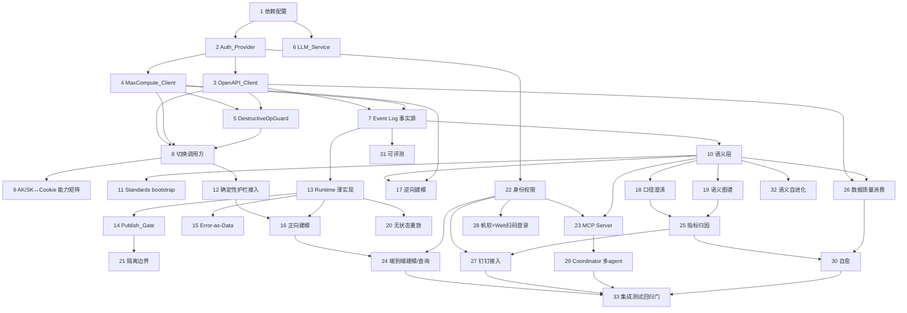

# Implementation Plan

## Overview

任务按 L0-L5 分层组织，L0（地基）优先且最细，L1-L5 逐层递进。

**⚠️架构澄清（2026-07，修正早期错误前提）**：当前 AK/SK **只有开发环境权限**
（可操作 dev schema/dev 数据源，元数据浏览类 API 如 ListDataSources/ListCatalogs/
ListLineages 也未授权），**生产环境的建表/建节点是通的**（真机验证过）。因此
Cookie 链路**不是待删除的过渡态，而是长期兜底 AK/SK 权限缺口的必要通道**——
早期"先并存、再切、最后删 Cookie"的 P0→P1→P2 三阶段表述是错的，已废弃。

**正确策略**：AK/SK 优先（处理它有权限的范围：dev 环境 + 建表/建节点/DI/holo 等
已验证的执行类操作），**AK/SK 走不通(403/无权限)的调用点固定走 Cookie 兜底**，
两条链路长期并存，按"能力矩阵"分工，不追求删除 Cookie。回归门为 `get_diagnostics`
+ `tests/` + `ruff`，发布前门为 `scripts/verify_ods_params`。每个任务标注覆盖的
Requirement。

## Task Dependency Graph



```json
{
  "waves": [
    { "wave": 1, "tasks": ["1"] },
    { "wave": 2, "tasks": ["2", "6"] },
    { "wave": 3, "tasks": ["3", "4"] },
    { "wave": 4, "tasks": ["5", "7"] },
    { "wave": 5, "tasks": ["8"] },
    { "wave": 6, "tasks": ["9", "10"] },
    { "wave": 7, "tasks": ["11", "12", "13", "19"] },
    { "wave": 8, "tasks": ["14", "15", "16", "17", "18", "20", "21"] },
    { "wave": 9, "tasks": ["22"] },
    { "wave": 10, "tasks": ["23", "24", "25", "26", "27", "28"] },
    { "wave": 11, "tasks": ["29", "30", "31", "32"] },
    { "wave": 12, "tasks": ["33"] }
  ]
}
```

## Tasks

### L0 — 地基：AK/SK 重构 + pyodps + LLM 接入 + Event Log

- [x] 1. 依赖与配置换血
  - `pyproject.toml`：新增 `pyodps`、LLM 客户端（`openai` 兼容 SDK）；移除 `playwright`、`cryptography`、`websockets`（确认无他用）
  - `.env.example`：新增 `ALIYUN_ACCESS_KEY_ID/SECRET`、`MAXCOMPUTE_ENDPOINT/PROJECT`、`LLM_BASE_URL/MODEL/API_KEY`；移除 `COOKIE_*`
  - `config.py`：确认 AK/SK 字段已就位，移除遗留 cookie 字段引用
  - NOTE(迁移安全，架构澄清后更新)：新增 `pyodps 0.13.0` / `openai 2.44.0` 与新配置字段已完成；`playwright`/`cryptography`/`websockets` 与 `COOKIE_*` **不再计划移除**——Cookie 链路长期保留（见 Task 9），这些依赖是其运行所需，不是待清理的过渡期占位。原"推迟到 Task 9(P2) 随 Cookie 链路一并删除"的表述已废弃。
  - _Requirements: 1, 2, 7_

- [x] 2. 实现 Auth_Provider
  - 新增 `dataworks_agent/auth/credentials.py`：仅从环境变量读 AK/SK，缺失抛 `CredentialMissingError`
  - 不读 ECS RAM Role / 本地 credentials 文件
  - 单元测试：缺失凭证快速失败
  - _Requirements: 2, 20_

- [x] 3. 实现 OpenAPI_Client（DataWorks 2024-05-18）
  - **NOTE(SDK 方法名校正)**：真实 `alibabacloud_dataworks_public20240518` SDK 命名与本 spec 假设不符，须以真实 SDK 为准：脚本/调度内嵌节点 Spec（无 `update_node_script`/`get_node_script`/`update_node_schedule`/`get_node_schedule`）；发布走 `create_deployment`/`get_deployment`/`list_deployments`/`exec_deployment_stage`（非 `deploy_node`）；元数据走 `list_tables`/`get_table`（非 `search_meta_tables`/`get_meta_table`）；血缘走 `list_lineages`/`list_lineage_relationships`（非 `get_column_lineage`）；DI 同步为 task/node 类型（无 `create_sync_task`）；DQC 走 `list_data_quality_rules`/`list_data_quality_results`（非 `list_dqc_rules`/`get_dqc_result`）。3.3-3.6 按此校正后实现。
  - [x] 3.1 基于 `alibabacloud-dataworks-public20240518` + `tea-openapi` 封装客户端骨架 + AK/SK 签名 + 指数退避重试（`_is_retryable` 按流控码前缀/HTTP 429·5xx 分类，非重试抛 `OpenAPIError`）
  - [x] 3.2 节点域：`create_node` / `update_node`(spec 内嵌脚本+调度) / `list_nodes` / `get_node` / `list_node_dependencies`
  - [x] 3.3 调度与发布域：Deployment 系（`create_deployment` / `get_deployment` / `exec_deployment_stage`）；真实字段核对后实现，3 mock 单测；**发布须经 Publish_Gate 人工授权**
  - [x] 3.4 元数据与血缘域：`get_table` / `list_tables` / `list_lineages`（+ 节点域已有 `list_node_dependencies`）；真实字段核对后实现，5 mock 单测覆盖
  - [x] 3.5 数据源与 DI 域：`list_data_sources`/`get_data_source` + **完整 DIJob 域** `create_dijob`/`get_dijob`/`list_dijobs`/`start_dijob`/`stop_dijob`（真实字段核对）；6 mock 单测。**修正早期误判**：2024-05-18 有独立且完整的 DIJob API（非"复用 create_node/无 create_sync_task"）；bff 手动跑 DI（create_di_executor_job+write_executor_config）对应 `start_dijob(force_to_rerun=True)`；建 DI 同步用 `create_dijob`（结构化 table_mappings/data_source_settings，比 bff filespec 规范）。→ **ods_di 可全量走 AK/SK，Task 9 删 cookie 不再受 DI 阻塞**（切调用点需把 di_config 产出的 filespec 重构为 CreateDIJob 结构，属 8b 后续接线）。
  - [x] 3.6 数据质量域：`list_data_quality_evaluation_tasks` / `list_data_quality_rules` / `list_data_quality_results`（DQC 只读消费入口：评估任务→规则→结果，供 Task 26 转 Quality_Signal）；3 mock 单测
  - [x] 3.7 单元测试（mock SDK）：签名、重试、错误分类（全域覆盖，共 26 单测，请求模型为真实 SDK 类，字段错会 TypeError）
  - _Requirements: 3, 5, 28_

- [x] 4. 实现 MaxCompute_Client（pyodps）
  - `dataworks_agent/api_clients/maxcompute_client.py`：`execute_ddl` / `submit_query` / `wait_and_fetch` / `get_table_schema`
  - AK/SK 鉴权、作业轮询到终态、结构化结果集、失败返回原因
  - 单元测试（mock pyodps）
  - _Requirements: 4, 5, 12_

- [x] 5. 实现 DestructiveOpGuard（执行层拦截）
  - `dataworks_agent/api_clients/destructive_guard.py`：`guard_sql`（拦 DELETE/TRUNCATE/DROP PARTITION/ALTER DROP COLUMN；DROP TABLE 仅放行 tmp_/test_；放行 INSERT OVERWRITE/CREATE/ALTER/SELECT）+ `guard_node_op`（拦删除/下线节点）
  - 接入 MaxCompute_Client 提交前与 OpenAPI_Client 节点删除前；仅执行层生效，不拦生成
  - 拦截事件写 Event_Log
  - NOTE：确定性关键字/正则分类（含注释剥离，防"行尾注释分号"绕过）；32 单测覆盖拦截/放行/多语句/节点操作。接入 Client 提交前 + Event_Log 记录待 Task 8/7 落地时接线（当前经 logger 记录）
  - _Requirements: 36_

- [x] 6. 实现 LLM_Service + LLM_Router + 数据边界守卫
  - `dataworks_agent/llm/`：OpenAI 兼容客户端（base_url/model/api_key 可配）、按复杂度路由（单模型时全路由该模型）、缺 key 快速失败
  - `ContextBuilder` 只装配 schema/元数据；`RowDataGuard` 提交前检测数据行，命中拦截 + 记 Event_Log
  - 单元测试：路由、缺 key、RowDataGuard 拦截
  - NOTE：RowDataGuard 用带 `kind` 标签的结构化片段做确定性边界校验（只放行 schema/metadata/instruction/prompt），在任何网络调用前拦截；13 单测覆盖。Event_Log 记录待 Task 7 落地接线
  - _Requirements: 7, 8_

- [x] 7. Event Log 升级为事实源（协议对象表）
  - 新增 ORM：`runs` / `checkpoints` / `events`（含 span/parent_span/seq）；`task_step_logs`/`pipeline_step_logs` 增 span 字段；`modeling_tasks` 增 actor_team/actor_org_code
  - 实现按 `session_id` 追加与有序查询、按 `seq` 支持 Last-Event-ID
  - 密钥脱敏写入层
  - 单元测试：追加、有序查询、脱敏
  - NOTE：新增 `dataworks_agent/eventlog/`（`store.EventLog` + `masking`）；seq 为全局单调，`events_by_session` 有序、`events_since(run, after_seq)` 支撑 Last-Event-ID；脱敏按 key 名启发式 + 已知密钥字面值双重打码；16 单测覆盖。✅迁移点已落地：`db/database.py` 新增幂等自愈 `_ensure_columns(engine)`（按 ORM metadata 对既有表 ADD COLUMN 补缺列，解决历史库 `data/dw_modeling.db` 缺 actor_team/span_id 等列导致启动崩溃）+ 3 单测；`init_db` 内 `create_all` 后调用
  - _Requirements: 9, 24, 29_

- [~] 8. 按能力矩阵切换调用方（⚠️非全量切换——AK/SK 有权限覆盖的才切，见 design.md §1.4）
  - 将 `modeling/`、`services/`、`governance/lineage_service.py`、`routers/*` 中对 `bff_client` 的调用，AK/SK 权限覆盖范围内的逐个切到 OpenAPI_Client / MaxCompute_Client（按 design.md §1.4 能力矩阵，非"迁移映射表"）；AK/SK 无权限覆盖的固定保留 bff_client 调用，不切换
  - `Root_Checker` 数据源切到本地 `词根.text`（`standards/loader.py`）或 pyodps
  - 回归：现有建模/血缘/数据源接口在两条链路分工下均通过
  - **NOTE(拆解)**：经全仓调用点梳理（~20 处），本任务非 1:1 换名，拆为三子块：
    - [x] 8a SQL/DDL 执行路径 → MaxCompute pyodps。**已完成**：① `DestructiveOpGuard` 焊入 `MaxCompute_Client.execute_ddl`/`submit_query` 提交前（Req 36.7，+5 单测）；② `MaxCompute/OpenAPI client` 注入 `app_state`（main.py，AK/SK 优雅降级）；③ 中央 SQL 读取 `sql_runner.run_odps_query` 改 **MaxCompute→IDA→MCP** 三级；④ `MaxComputeClient` 加 `table_exists`/`get_table_ddl`；⑤ **各建表 DDL 执行点全切 mc（剥离 DROP 避护栏）**：`dwd/deploy`、`modeling/engine`、`ods_di/ensure_table`（registry 查询/现有 DDL/建表三处均 mc 化）、`ods_holo/ensure_holo_table`（dev+prod）、`routers/batch_deploy`；均缺 mc 降级 bff。+ensure_table mc 路径 3 单测。412 单测全绿、应用可启动。
    - [~] 8b 节点创建/调度/发布路径 → OpenAPI Spec/Deployment：`create_node`/`update_vertex`/`deploy_nodes` + 私有 `_post ide/createPackage`/`_put ide/addNodeDependencies`/`_get listRepositoryTreeV2` + VFS 的 `get_file`/`get_node_uuid_by_path`/`parse_ide_file`。**已完成**：① `api_clients/flowspec.py`（`build_node_flowspec` 纯函数，把 script/trigger/参数/自依赖/**上游依赖 upstream_refs**/outputs 翻译成 2024-05-18 FlowSpec JSON，结构对齐真机 get_node().Node.Spec）+ 13 单测。② **纯 AK/SK 真机建节点已跑通**（真实案例 google_campaign ODS+DWD 建到 `业务流程/106_广告报告/.../00_ODS`·`/02_DWD`，草稿态未发布）：`create_node(spec, container_id=None, scene="DATAWORKS_PROJECT")`，落位由 `script.path` 决定；enum 坑（inputs.sourceType 只认 Manual/System、flow.depends.type 用 Normal）已固化到 flowspec + CLAUDE.md §7.6；DWD→ODS 硬依赖真机验证。`delete_node` 亦验证可用（高频会 Throttling.User 需退避）。③ **AK/SK 节点适配器已建**：`api_clients/openapi_node_adapter.py`（`OpenAPINodeAdapter`，drop-in 复刻 bff 的节点 5 方法 `create_node`/`update_node`/`update_vertex`/`deploy_nodes`/`get_node_uuid_by_path`，get-modify-write 模式，`last_error` 兼容通道）+ 9 mock 单测；`list_nodes` 返回项含 `Script.Path`（真机核实）故 `get_node_uuid_by_path` 走分页扫描匹配；`main.py` lifespan 构造 `app_state._node_client`（AK/SK 可用时）。真机只读验证 `_load_spec` 能解析既有 ODS 节点 Spec。④ **已切纯节点调用点**：`routers/pipeline.py` 的 OSS 批量(`OssImportPipeline`) 与实时批量(`RealtimeSyncPipeline`) 两条 ODPS 纯节点流水线的注入改为 `app_state._node_client or _bff_client`（AK/SK 优先、缺则降级 bff）；二者只用节点 5 方法(create/update/vertex/deploy + last_error)，与适配器完全兼容，391 单测全绿。⑤ **混合调用点已切第一例 `dwd/deploy`（8a+8b 合切）**：`DwdDeployPipeline.__init__` 增 `node_client`/`mc_client` 注入；建表走 `MaxComputeClient`（`table_exists` 新增 + `execute_ddl`，**剥离开头 `drop table if exists` 避开 DestructiveOpGuard 拦 DROP**，仅表不存在时建）、节点操作走适配器、依赖内嵌 `update_vertex` 的 dependencies（免 bff 私有 `_put addNodeDependencies`）；`routers/dwd.py` 注入三客户端，缺 AK/SK 降级 bff 原路径（分支保留）；+5 单测。⑥ **`modeling/engine` DWD 流程已切（8a+8b）**：建表走 MaxCompute(`table_exists`+`execute_ddl`+剥离 DROP)、节点走适配器、缺 AK/SK 降级 bff；"剥离 DROP" 收敛为 `di_config.strip_leading_drop_table()` 公共函数（engine 与 dwd/deploy 共用）。399 单测全绿、应用可启动。⑦ **DI 节点接线（数据开发 DI 节点，非 DIJob）**：真机核实 DI 节点 FlowSpec = `script.language="json"` + `runtime{command:"DI",commandTypeId:23}` + `datasource=null` + content 为 DataX filespec（见 CLAUDE.md §7.7）。`flowspec.build_node_flowspec` 加 `language="di"` 支持（+2 单测）；`ods_di/create_node.create_di_node` 改双路径（适配器无 `_post`→`create_node(language="di")`+update_node+update_vertex 内嵌依赖；bff 有 `_post`→原 createPackage+addNodeDependencies）（+3 单测）；`DIPipeline` 加 `node_client` 注入（建节点走适配器，建表/字段推断/数据源仍走 bff 独有），`routers/workspace` 注入 `_node_client`。408 单测全绿。**注**：`init_workflow` 的首次初始化（手动试跑 create_di_executor_job/write_executor_config + prod copy execute_sql_ida）为 IDE 试跑类能力、无 OpenAPI 通用等价，留 bff。**待做（需人工审批/耦合 8a）**：① `routers/batch_deploy` 因 ODS 走 holo，归 holo 决策一起处理；② holo 节点路径(`routers/schedule_config`、`workspace` 的 ODS→Holo + IMPORT FOREIGN SCHEMA) 经 OpenAPI 建 holo 节点未真机验证，暂留 bff；③ `ods_di/*` 用 DI executor/raw _post/_put/get_file 等 bff 独有能力，留 bff；④ 真机发布(deploy_nodes→create_deployment)未真机验证，且属生产写，须经 Publish_Gate 人工授权 + dev schema 验证。
    - [x] 8c 血缘/元数据查询 → OpenAPI：lineage_service 的 `get_upstream_tasks`/`get_node_list`/`get_node_parents_by_depth`/`get_node_code` → `list_node_dependencies`/`get_node`（+ 分页匹配）。**已完成**：`governance/lineage_provider.py`（OpenAPILineageProvider，4 方法映射，BFS/导出/解析器零改动）+ 14 单测 + 真机端到端验证；`main.py` 建 `app_state._openapi_client`（AK/SK，与 bff 并存降级）；`routers/governance.py` 的 lineage preview/export 切到 provider。**保留 bff**：`routers/lineage.py` 的 `get_downstream`(list_lineage 下游 DAG) 因映射的 `list_lineages` 需 `dataworks:ListLineages` 权限（当前 403）暂留 bff。**性能注**：`get_upstream_tasks`(按表名反查产出节点) 走 list_nodes 分页扫描；若后续授予细粒度 `dataworks:ListLineages`（非 full access）可改血缘快查。
  - _Requirements: 3, 4, 5, 6_

- [~] 9. AK/SK↔Cookie 能力矩阵与兜底路由（原"删除 Cookie 链路"，架构已修正见 Overview）
  - **不再删除** `cookie/`、`api_clients/cdp_client.py`、`mcp/pool.py`、`api_clients/bff_client.py`——AK/SK 仅开发环境权限
    （dev schema/dev 数据源 + 无 DataMap 元数据类授权），Cookie 是生产权限缺口的**长期**兜底，非过渡态。
  - 目标改为：① 每个调用点明确标注走 AK/SK 还是 Cookie（能走 AK/SK 的已切完，见下）；② 清理 Cookie 链路里的**死代码**
    （不改变能力，只删无效路径）；③ CDP 客户端（SQL 格式化等活跃功能）保留，不纳入清理范围。
  - NOTE(盘点+能力矩阵)：全仓 bff/cookie 调用点已盘清。DataMap 元数据层级 API（`list_catalogs→list_databases→
    list_schemas→list_tables→list_columns`，`parent_meta_entity_id` 逐层下钻）**方法已实现**（client 补
    `list_catalogs`/`list_databases`/`list_schemas`/`list_columns`，+4 mock 单测），但真机验证：当前 AK/SK
    账号（开发权限）对 `ListDataSources`/`ListCatalogs`/`ListLineages` 等元数据域**403 无权限**——这是
    **架构预期内**（开发权限不含元数据浏览类 RAM 权限），不是待批的临时缺口。故以下**固定走 Cookie**（非"等
    授权切换"，是长期分工）：`list_datasources`/`list_datasource_tables`（field_infer/table_discovery/
    workspace 选源表）、`search_tables`（搜表）、`listRepositoryTreeV2`（目录树）、`list_lineage` 下游血缘。
  - NOTE(9a 已切，AK/SK 处理其权限范围内的部分)：① `routers/pipeline.py` 的 OSS/实时批量纯节点流水线；
    ② `dwd/deploy`/`modeling/engine`/`routers/batch_deploy` 的建表(MaxCompute，剥离 DROP)+建节点(适配器)；
    ③ `ods_di/ensure_table`/`ods_holo/ensure_holo_table` 的 registry 查询/现有 DDL/建表；④ `ods_di` 的 DI
    节点(FlowSpec language=di)与 DIJob 域(create_dijob/start_dijob 等)；⑤ Holo 建节点(flowspec commandTypeId
    =1093/datasource=dataworks_holo 真机验证)，`IMPORT FOREIGN SCHEMA` 随 DML 留节点内容由 DataWorks 执行；
    ⑥ `routers/schedule_config` 节点操作、`local_ddl_registry`/`table_discovery` 的现有表 DDL 读
    （`mc.get_table_ddl`）；⑦ 8c 血缘上游/元数据（`OpenAPILineageProvider`）。412 单测全绿、应用可启动、
    真机跑通 google_campaign ODS+DWD 建表建节点案例（`业务流程/106_广告报告/...`）。**均缺 AK/SK 时降级 bff**
    ——这个降级分支现在的意义变成"AK/SK 就是没权限时兜底走 Cookie"，与原"迁移期并存"语义不同但代码结构不变。
  - NOTE(死代码清理，不影响能力)：① `mcp/pool.py` 的 `decrypt_cookie()` Cookie 注入是死代码——`mcp.json` 里
    `data-mcp` 服务器认证走 `Authorization: Bearer <token>`（Cookie 字段本就是空占位），删除不影响 MCP（真机
    验证"MCP 会话已建立"正常）；② `main.py` 的 `cookie_extracted` 硬编码 False 死分支一并删除。**未清理（非
    死代码，保留）**：CDP 客户端（`cdp.format_and_save()` SQL 格式化、`routers/cookie.py` 全套 cookie 管理
    路由）是活跃功能。
  - **待做**：① `init_workflow` IDE 手动试跑（create_di_executor_job/write_executor_config）无 API 等价，
    继续走 Cookie（不是"移交"，是长期分工）；② 逐调用点在代码注释/文档标注"此处固定走 Cookie：原因=开发权限
    不含 X"，避免后续又被误判成"待迁移"；③ 评估是否需要给 AK/SK 账号额外申请**生产环境**建表/建节点权限
    （当前验证通过的项目是否已涵盖生产空间需与平台侧确认边界，勿假设）。
  - _Requirements: 1_

### L1 — 语义层 v1 + 双向建模 + 解耦 + 审批 + 口径澄清

- [ ] 10. 语义层数据模型与服务
  - 新增 ORM `semantic_definitions`（版本化）；实现 `SemanticLayer`（get_metric_definition/resolve_caliber/upsert_definition/get_quality_signal），冲突口径拒绝写入 + 保留历史
  - _Requirements: 10_

- [ ] 11. Standards_Bundle 导入 bootstrap
  - 解析 `warehouse/*.yaml` + `standards/steering/*.md` + `词根.text` 落库为初始语义规则（分层引用/主题域/更新方式/类型规则/词根）
  - _Requirements: 10_

- [ ] 12. 确定性护栏接入（提议校验器）
  - 复用 `Root_Checker`/`DDL_Checker`/分层校验，封装为统一"提议校验"入口；未过校验不得建表
  - _Requirements: 11, 14_

- [ ] 13. Agent Runtime 薄实现（协议对象 + 生命周期）
  - `dataworks_agent/runtime/`：start_run/stream/interrupt/resume/cancel/retry；复用 `PersistentPipelineQueue`/`reconciliation`/`state_machine`；领域逻辑不 import agent 框架
  - _Requirements: 16, 29_

- [ ] 14. Publish_Gate（interrupt/resume）
  - 生产写建模为 interrupt：Checkpoint 快照 + 变更载荷 + 权限上下文；Web 审批后 resume
  - _Requirements: 14_

- [ ] 15. Error-as-Data 与错误边界
  - `classify_error` → RECOVERABLE 回传 LLM / SYSTEM|SECURITY 中断；有 Checkpoint 只重试失败 Step
  - _Requirements: 30_

- [ ] 16. 正向建模流程（重构 engine）
  - `ForwardModelingFlow`：NL/需求 → 推断分层域命名 → 查源结构 → 生成 DDL/DML/调度 → 校验 → 审批 → 执行；拆解现有 `modeling/engine.py`
  - _Requirements: 11, 17_

- [ ] 17. 逆向建模流程
  - `ReverseModelingFlow`：存量表/SQL/节点 → 抽结构(pyodps/元数据) + 血缘(sql_lineage) + 反推分层(table_name_parser/update_mode_inferer) + LLM 口径候选 → 审批后写语义层；支持批量 bootstrap；复用 ImportSql 入口
  - _Requirements: 12_

- [ ] 18. 口径澄清（指标归因第一步，只读）
  - `resolve_caliber` 驱动：业务预期 vs 实际口径比对，能解释即结案
  - _Requirements: 32_

### L2 — 语义知识图谱 + 无状态重放

- [ ] 19. Semantic_Graph
  - 新增 ORM `semantic_graph_edges`；融合血缘 + 语义 + 元数据 + 质量信号；`get_table_context`；逆向抽取 bootstrap
  - _Requirements: 13, 15_

- [ ] 20. 无状态重放续跑
  - 按 `session_id` 从 Event_Log/Checkpoint 重建并从最后成功步之后续跑；幂等跳过已成功副作用
  - _Requirements: 16, 30_

- [ ] 21. 隔离边界落实
  - 确认执行仅经 dev schema + dry_run + 审批 + AK/SK 最小权限；不实现 MicroVM
  - _Requirements: 17_

### L3 — 自建 MCP + 端到端 + 指标归因 + 数据质量 + 渠道 + 身份权限

- [ ] 22. 身份与权限（UserDirectory + PermissionModel）
  - 新增 ORM `user_directory`（缓存钉钉表 join 用户表）；`PermissionModel` 按团队/组织编码授权 + 数据范围；未登录回退 IP 只读；统一接入 MCP/查询/归因；Event_Log 记 user/team/org_code
  - _Requirements: 18, 27, 34_

- [ ] 23. 自建 AK/SK MCP Server
  - `dataworks_agent/mcp_server/`：暴露六类工具（语义/元数据、建模、查询、归因、治理、会话）；每次调用鉴权 + 审计 + 数据边界；不提供执行删数删表删任务工具
  - _Requirements: 18, 35, 36_

- [ ] 24. 端到端建模与对话查询
  - 单 agent：NL 建模（提议-校验-审批）+ 基于语义口径的 `run_query`（权限收敛、只读）；引用未定义口径拒绝
  - _Requirements: 19_

- [ ] 25. 指标归因诊断完整流程
  - 口径澄清 → 血缘逐层取聚合值比对(pyodps)定位偏离层 → 五类根因分类 + 证据 → 修复提议(审批) → 沉淀知识库；数值比对确定性工具做、只把结论给 LLM
  - _Requirements: 32_

- [ ] 26. 数据质量消费（DQConsumer）
  - 新增 ORM `quality_signals`；拉 DataWorks DQC 结果 → 转 Quality_Signal 进语义层；agent 提议质量规则(审批后写 DQC)；引用不可信数据告警；不自建 DQ 引擎
  - _Requirements: 28_

- [ ] 27. 钉钉群接入（DingTalk_Adapter）
  - 新增 ORM `anomaly_reports`；群机器人接收 @机器人 → 解析 Anomaly_Report；信息不全会话内追问；只读结论回帖；发送者身份经 PermissionModel 归属；回帖按权限收敛不吐明细
  - _Requirements: 33, 34_

- [ ] 28. 帆软报表接入 + Web 钉钉扫码登录
  - `FineReport_Adapter`：从报表上下文发起诊断，口径以语义层为准
  - Web 后端 `/auth/dingtalk/callback` + 前端扫码登录，解析团队/组织编码；渠道适配器统一接口，新渠道不改核心
  - _Requirements: 35, 34, 10_

### L4 — Coordinator + 多 agent + 模型路由 + 跨域

- [ ] 29. Coordinator 与多专业 agent
  - 编排需求理解/架构/建模/治理/诊断/查询专业 agent；任务分解分派汇总；跨域架构/成本优化经审批；子任务失败阻断下游
  - 评估是否引入 LangGraph/Deep Agents 作底层引擎（协议对象契约不变）
  - _Requirements: 20_

### L5 — 持续自愈 + 语义自进化 + 可评测

- [ ] 30. 自愈流程（SelfHealFlow）
  - 调度失败/数据异常诊断 + 修复提议（生产写审批）；数据异常含质量维度
  - _Requirements: 21, 28_

- [ ] 31. 可评测与反馈闭环（Evaluator）
  - 新增 ORM `badcases` / `eval_metrics`；质量指标（一次过校验率/语义采纳率/口径命中率）+ Badcase 沉淀 + 归因 + 反馈驱动 prompt/工具/规范迭代；评测只用 schema/元数据
  - _Requirements: 31_

- [ ] 32. 语义自进化
  - 检测新口径/别名/维度候选 → 产出演进提议供人确认；未确认不写单一事实源；行为进 Event_Log
  - _Requirements: 21_

### L0.5 — Loop Engineering 基础设施

参考 Loop Engineering 理念，把"发现问题→想办法→动手→检查"的循环从人身上剥下来，装到 Agent 身上。验收标准、Memory、任务接力是实现 Closed Loop 的三大支柱。

- [ ] 34. 闭环验收器实现
  - 新增 `dataworks_agent/governance/closed_loop_verifier.py`
  - 实现 `ClosedLoopVerifier.verify(task_id)` 方法
  - 按任务类型配置验收检查清单（ODS/DWD/DIM/DWS）
  - 验收结果写入 Event_Log
  - 集成现有 `ddl_checker`、`root_checker`、`sqlglot`、`verify_ods_params`
  - 单元测试：验收通过/失败场景
  - _Requirements: 37_

- [ ] 35. 任务 Memory 服务
  - 新增 `dataworks_agent/task_engine/task_memory.py`
  - 实现 `TaskMemoryService` (get/update/append_decision/append_artifact/generate_next_steps)
  - 新增 ORM `task_memory` 表（progress/decisions/artifacts/next_steps/blockers/verification）
  - 在 `modeling/engine.py` 的关键步骤写入 Memory
  - 在任务完成时自动生成 `next_steps`
  - 单元测试：Memory 读写、next_steps 生成
  - _Requirements: 38_

- [ ] 36. 任务接力器
  - 新增 `dataworks_agent/task_engine/task_chainer.py`
  - 新增 `dataworks_agent/task_engine/chaining_rules.yaml`（接力规则配置）
  - 实现 `TaskChainer.on_task_complete(task_id)` 事件处理
  - 在 `modeling/engine.py` 任务完成时触发接力
  - 接力前检查前置任务验收状态（必须是 `verified`）
  - 支持配置接力规则的启用/禁用
  - 单元测试：接力触发/跳过/依赖检查
  - _Requirements: 39_

- [ ] 37. Orchestrator 薄实现
  - 新增 `dataworks_agent/runtime/orchestrator.py`
  - 实现 `Orchestrator.run(goal)` 方法
  - 集成 TaskMemory + TaskChainer + ClosedLoopVerifier
  - 支持 fan-out 并行执行
  - 支持 interrupt/resume（人工干预）
  - 单元测试：目标分解/并行执行/结果汇总
  - _Requirements: 39_

### 贯穿性

- [ ] 33. 集成测试与回归门
  - 每渠道一条端到端（Web 建模审批 / 钉钉归因 / MCP 工具 / 帆软诊断）
  - 数据边界测试（不发数据行、不吐明细）、重放幂等测试、破坏性操作拦截测试
  - CI 跑 `tests/` + `ruff`；保留 `scripts/verify_ods_params` 作发布前门
  - _Requirements: 8, 16, 24, 30, 31, 36_

## Notes

- **架构澄清**：AK/SK 仅开发环境权限（dev schema/dev 数据源 + 无元数据浏览类授权），
  生产建表/建节点已验证可行；Cookie 长期兜底 AK/SK 权限缺口的调用点（详见 Task 9）。
  不再是"迁移完就删 Cookie"，而是两条链路按能力矩阵长期并存。
- **协议对象稳定**：L1-L3 自建薄 runtime，L4 才评估引入 LangGraph/Deep Agents，且不改领域逻辑。
- **护栏贯穿**：所有涉及生产写/执行的任务，必须经确定性校验 + Publish_Gate 审批 + DestructiveOpGuard，且只喂元数据不喂数据行。
- **配置**：LLM `base_url=https://opencode.ai/zen/v1`、`model=deepseek-v4-flash-free`；DROP PARTITION 默认禁止执行（如需放开再调 Task 5）。
- L4/L5 任务较粗，进入前应基于 L1-L3 落地情况细化。
