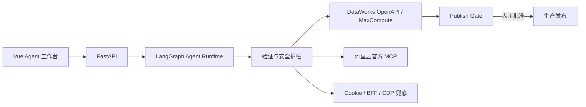

# dataworks-agent

> 面向阿里云 DataWorks 的可视化数仓 Agent：用自然语言完成建模、分析、排障和执行编排。

本项目不是替代 DataWorks，而是在其上增加一层可审计的 Agent 工作台：统一理解业务目标、生成执行计划、调用开发环境能力、验证结果，并把生产发布停在人工审批闸口。

## 核心能力

| 场景 | 能力 | 当前边界 |
|---|---|---|
| 正向建模 | 数据源/存量 ODS → ODS、DWD、DIM、DWS 的表、SQL、节点、依赖和调度 | 可规划；Dev 新建表和节点可执行 |
| 逆向建模 | 读取存量表、节点脚本、结构和依赖，生成分层与语义候选 | 依赖真实元数据权限 |
| 异常排查 | 汇总任务、节点、依赖、日志和运行底座状态，给出恢复建议 | 高风险修复需确认 |
| 自主问数 | 口径澄清、资产约束、只读 SQL、最新分区和结果对账 | 未认证口径不冒充生产口径 |
| Cookie 管理 | 检查并维护 Cookie/BFF/CDP 兜底通道 | 仅补足 AK/SK 权限缺口 |

Agent 统一使用有界循环：

```text
Objective → Act → Verify → Repair → Retry → Stop
```

## 设计原则

1. **开源框架优先**：LangGraph 负责 Agent 状态图、检查点和重试编排，不重复制造通用运行时。
2. **通用能力上线**：工作流、执行护栏、审批、可视化和知识结构属于产品能力。
3. **私有知识留本地**：AK/SK、Cookie、业务指标、公司目录、真实表样例和 Badcase 不进入公共代码库。
4. **前端体验优先**：测试用于守住回归，但不能替代真实页面、真实接口和真实用户路径验收。
5. **生产发布人工确认**：Agent 可以执行受控的 Dev 操作，不能绕过 Publish Gate 自动发布生产。
6. **双通道长期并存**：AK/SK/OpenAPI 负责开发执行；Cookie/BFF/CDP 负责 OpenAPI 无权限覆盖的元数据能力。

更完整的通用化边界见 [docs/product/agent_operating_model.md](docs/product/agent_operating_model.md)。

## 架构



## 技术栈

- **Agent**：LangGraph
- **后端**：Python 3.12、FastAPI、Pydantic、SQLAlchemy、SQLite、httpx、structlog
- **前端**：Vue 3、TypeScript、Vite、Element Plus、Pinia、Vue Router
- **数据平台**：DataWorks OpenAPI 2024-05-18、MaxCompute/pyodps、阿里云官方 DataWorks MCP
- **兼容通道**：DataWorks BFF、Chrome DevTools Protocol、Playwright
- **模型接入**：OpenAI 兼容 API

## 快速启动

### 环境要求

- Python 3.12+
- [uv](https://docs.astral.sh/uv/)
- Node.js 20.19+（或 22.12+）
- Dev 执行需要可用的 DataWorks/MaxCompute AK/SK
- Cookie 兜底需要已登录 DataWorks 的 Chrome 调试会话

### 1. 配置

```powershell
Copy-Item .env.example .env
uv sync
```

至少检查以下配置：

- `LLM_BASE_URL`、`LLM_MODEL`、`LLM_API_KEY`
- `DATAWORKS_PROJECT_ID`、`DATAWORKS_REGION`
- `MAXCOMPUTE_PROJECT`、`MAXCOMPUTE_ENDPOINT`
- `ALIYUN_ACCESS_KEY_ID`、`ALIYUN_ACCESS_KEY_SECRET`（Dev 执行）
- `COOKIE_ENCRYPTION_KEY`（至少 16 个字符）

完整配置及说明见 [.env.example](.env.example)。

### 2. 启动后端

```powershell
uv run python -m dataworks_agent.main
```

后端地址：`http://127.0.0.1:8085`

需要同时拉起 Chrome/Cookie 链路时，也可以运行：

```powershell
.\start.bat
```

### 3. 启动前端

```powershell
Set-Location frontend
npm install
npm run dev
```

前端地址：`http://localhost:3000`

## 执行边界

### Agent 模式

| 模式 | 行为 |
|---|---|
| `plan` | 只生成计划和产物，不写 DataWorks |
| `auto` | 自动选择规划或受控 Dev 执行，遇到风险操作暂停 |
| `dev_execute` | 允许 Dev 新建表、节点和初始化；修改、删除、发布仍受控 |

### 操作审批

| 操作 | 策略 |
|---|---|
| Dev 新建表 | 允许自动执行 |
| Dev 新建节点 | 允许自动执行 |
| 修改已有节点 | 执行前确认 |
| 删除节点 | 执行前确认 |
| 生产发布 | 必须人工批准 Publish Gate |

## 核心 API

| API | 用途 |
|---|---|
| `POST /agent/chat` | 对话规划或 Dev 执行 |
| `GET /agent/capabilities` | 查看运行框架和各执行通道状态 |
| `GET /agent/status` | 查看最近任务状态 |
| `GET /agent/status/{task_id}` | 查看指定任务状态 |
| `WS /agent/ws` | 实时对话与状态更新 |
| `GET /agent/publish-gate/requests` | 查看待审批发布请求 |
| `POST /agent/publish-gate/{request_id}/approve` | 人工批准并发布 |
| `POST /agent/publish-gate/{request_id}/reject` | 人工拒绝发布 |

默认还提供建模、治理、血缘、同步、任务和产物等 `/api/*` 路由；实验性语义/Runtime/MCP Server 路由由 `ENABLE_EXPERIMENTAL_PLATFORM_ROUTES` 控制。

## 关键目录

```text
dataworks_agent/
├── agent/          # 对话理解、规划、执行和状态图
├── runtime/        # LangGraph 循环、工作流、审批与评测
├── modeling/       # DDL/DML、建模引擎和 DataWorks 产物
├── services/       # DI、Hologres、OSS、Realtime 等数据接入
├── api_clients/    # OpenAPI、MaxCompute、BFF、CDP 客户端
├── semantic/       # 指标、语义知识与问数约束
├── governance/     # DDL、词根、血缘和规范检查
└── routers/        # FastAPI 路由

frontend/src/
├── components/agent/ # Agent 对话与执行可视化
├── pages/            # 页面
└── router/           # 前端路由

tests/              # 后端测试与评测
frontend/e2e/       # 浏览器 E2E
scripts/            # 运维脚本
docs/               # 设计、计划、评审和产品文档
```

## 验证

文档或后端小改动先做最小检查；功能改动最终必须补前端构建和真实页面验收。

```powershell
uv run python -m compileall -q dataworks_agent
uv run ruff check .
uv run python -m pytest tests/unit/test_agent tests/unit/test_agent_router.py -q --tb=short

Set-Location frontend
npm run build
npm run test:unit
```

上线前不要只看测试数量，应确认：页面可打开、对话可继续、执行步骤可见、确认点有效、Publish Gate 不可绕过。

## 安全与知识边界

- 凭据只通过环境变量或本地 `.env` 注入，不写入代码、SQLite、日志或 Git。
- 通用仓库只保存能力、规则和知识结构，不保存私有业务指标与真实账号数据。
- 破坏性操作必须经过项目内 guard；生产发布只认 Publish Gate 的人工结果。
- OpenAPI 元数据权限不足时走 Cookie 兜底，不通过扩大 AK/SK 权限或前端直连绕过。
